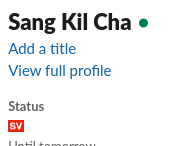
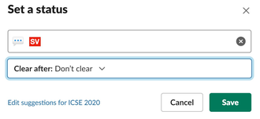
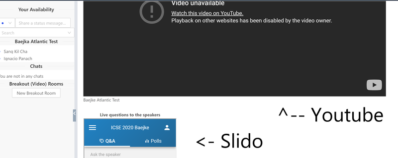

ICSE 2020 Student Volunteer Handbook
===

Thank you for being a Student Volunteer (SV) at ICSE 2020. As you already know,
ICSE 2020 is going virtual for the first time ever. This means, you are going to
be the first virtual SV in the history of ICSE!

The main role of SVs is to run the conference smoothly. You will help
participants get the most out of the conference, and make them happy all through
the conference.

This handbook should provide you with the main information about your duties at
ICSE 2020. If you have any questions or suggestions, please feel free to create
a PR (Pull Request). We will do our best to keep this document up to date.

# Table of Contents

- [ICSE 2020 Student Volunteer Handbook](#icse-2020-student-volunteer-handbook)
- [Table of Contents](#table-of-contents)
  - [Understanding Virtual ICSE](#understanding-virtual-icse)
  - [ICSE Live! Team](#icse-live-team)
  - [SV Shift Plan](#sv-shift-plan)
  - [Schedule and Assignments](#schedule-and-assignments)
  - [SV Types](#sv-types)
  - [SV Chairs](#sv-chairs)
  - [Slack for All Communication](#slack-for-all-communication)
    - [Slack Channels](#slack-channels)
    - [Slack Profile](#slack-profile)
    - [Slack Display Name](#slack-display-name)
  - [Clowdr](#clowdr)
  - [Description of SV Tasks](#description-of-sv-tasks)
    - [Online SV](#online-sv)
      - [Helping Live Casting](#helping-live-casting)
      - [Managing 24-hour Help Desk](#managing-24-hour-help-desk)
      - [Using Social Media](#using-social-media)
    - [Offline SV](#offline-sv)
    - [CLE SV](#cle-sv)
  - [Live Session Example Scenario](#live-session-example-scenario)
  - [FAQs](#faqs)

## Understanding Virtual ICSE

The whole conference runs by three (plus one for China) independent teams in
three different time bands. The three time bands are the Pacific, Indian
(Asian), and Atlantic (EU) time band, which will cover `00:00 - 03:00`, `07:00 -
10:00`, and `15:00 - 18:00` in UTC. For more detailed information, please visit
the main [ICSE web site](https://conf.researchr.org/home/icse-2020).

Each team will take care of one three-hour-long session per day. Specifically, each
team will handle regular sessions for two hours, and smaller event sessions,
such as poster and demo sessions, for one hour.

## ICSE Live! Team

The conference will be live-cast to youtube (and to iQIYI for Chineses friends),
and there are four dedicated teams that we call ["ICSE Live!
Team"](https://2020.icse-conferences.org/committee/icse-2020-virtualization-regional-live--team-leaders)
for each time band (plus China). Please note that live broadcasting should be
done by the ICSE Live! Team, but not by SVs. The role of SVs should not be
confused with the ones of Live! Team.

To understand how the ICSE Live! Teams operate, see
[this](https://github.com/crista/icse2020-live).

## SV Shift Plan

We run three shifts for 24 hours, 8-hour each.

- Pacific time shift: 22:00 - 6:00 UTC
    - This includes the Pacific time band (00:00 - 03:00 UTC)
    - SVs here will work with the Pacific team.
- Indian time shift: 06:00 - 14:00 UTC
    - This includes the Indian time band (07:00 - 10:00 UTC)
    - SVs here will work with the Indian team.
- Atlantic time shift: 14:00 - 22:00 UTC
    - This includes the Atlantic time band (15:00 - 18:00 UTC)
    - SVs here will work with the Atlantic team.

## Schedule and Assignments

|       	| Pacific time shift                                                                                                                  	| Indian time shift                                                                                                         	| Atlantic time shift                                                                                                                                  	|
|-------	|-------------------------------------------------------------------------------------------------------------------------------------	|---------------------------------------------------------------------------------------------------------------------------	|------------------------------------------------------------------------------------------------------------------------------------------------------	|
| **July 7** 	| Nischal Shrestha Lingjun Liu Haemin Ryu Nianyu Li Soumik Mohian Zhiqiang Wu                                          	| Benny Chun Gichan Lee Jiho Shin Jaeseung Choi Minxing Tang Rusen Halepmollasi                  	| Armstrong Foundjem Akalanka Galappaththi Anderson Jose Silva de Oliveira Anderson Uchoa Camilo Escobar-Velasquez Cristiano Politowski 	|
| **July 8** 	| Nischal Shrestha Lingjun Liu Haemin Ryu Shivani Shirolkar Soumik Mohian Zhiqiang Wu                                  	| Alfredo Ibias Qurat ul ain Ali Tobias Schwarz Sorour Jahanbin Shiwei Feng Rusen Halepmollasi                     	| Armstrong Foundjem Akalanka Galappaththi Anderson Jose Silva de Oliveira Anderson Uchoa Camilo Escobar-Velasquez Cristiano Politowski 	|
| **July 9** 	| Daye Nam Caio Barbosa Vieira da Silva Mohammad Abdul Hadi Harsha Perera Huilian Sophie Muhammad Umair Khan           	| Gebrehiwet Biyane Welearegai Alfredo Ibias Benny Chun Gichan Lee Tobias Schwarz Jiho Shin                    	| Cristiano Politowski David A Nader Palacio Dewi Yokelson Denivan Campos Daniel Tenorio Martins de Oliveira Eduardo Fernandes          	|
| **July 10** 	| Sohil Lal Shrestha Caio Barbosa Vieira da Silva Mohammad Abdul Hadi Harsha Perera Huilian Sophie Muhammad Umair Khan 	| Jaeseung Choi Ananga Thapaliya Qurat ul ain Ali Christoph Matthies Sorour Jahanbin Shiwei Feng               	| Cristiano Politowski David A Nader Palacio Dewi Yokelson Denivan Campos Daniel Tenorio Martins de Oliveira Eduardo Fernandes          	|
| **July 11** 	| Daye Nam Ahmad Abdellatif Nianyu Li Rishab Sharma Shivani Shirolkar Xin Chen                                 	| *no sessions*	| Elson Kurian Ivan Arcuschin Moreno Zhenhao Li Luana Martins Luiz Carvalho Nathan Cooper                                               	|

- Co-located Events (CLEs)
  - MSR (10:30 - 17:00 UTC, June 29-30): Chua Kiat Kian Anthony and Seungchyul Shin
  - BotSE (15:00-20:00 UTC, July 2): Glaucia Melo
  - FormaliSE (7:00-9:00 & 15:00-17:00 UTC, July 13): Doyeon Kim
  - AST (7:30 - 9:00 UTC & 14:00 - 17:00 UTC, July 15-16): Renan Greca
  - ICPC: Henriette-Flore KENNE
- Offline SVs
  - Ana Carla Gomes Bibiano
  - Agustin E. Martinez Sune
  - Miller Andres Trujillo Achury
  - Nan Yang
  - Radu Prekup
  - Sadura Akinrinwa
  - Sarah Fakhoury
  - Saulo Soares de Toledo
  - Shayan Zamani
  - Xianhao Jin
  - Didem Yanıktepe

## SV Types

Unlike traditional conferences, we divide SVs into three groups: online SVs,
offline SVs, and CLE SVs.

- *Online SVs* work closely with a regional [ICSE Live!
  team](#icse-live-team). Online SVs will work in one of the three
  [shifts](#sv-shift-plan). We will assign Online SVs based on which time band
  they belong to. For example, SVs in the Pacific time band will work with the
  Pacific team.

- *Offline SVs* work asynchronously to help edit videos, and upload videos to
  either youtube or iQIYI. Therefore, offline SVs do not need to be bound to a
  specific time zone.

- *CLE SVs* support CLEs (Co-Located Events), and their work is largely similar
  to those of online SVs.

## SV Chairs

SV chairs lead the overall organization of SVs and interface with the general
chair and live teams. Although we will try to use Slack for all communication (see below), if you need another way to reach the SV Chairs, you can email icse2020.sv@gmail.com.

- Pacific Time Band: [Sang Kil Cha](https://softsec.kaist.ac.kr/~sangkilc/)
- Indian (Asian) Time Band: [Jose Miguel Rojas](http://jmrojas.github.io/)
- Atlantic Time Band: [Hamid Bagheri](https://cse.unl.edu/~hbagheri/) and  [Carolyn Seaman](https://userpages.umbc.edu/~cseaman/)

## Slack for All Communication

It is absolutely critical that we communicate effectively and continuously
during the conference. We will be using Slack fo all communication among
SVs and SV Chairs.

### Slack Channels

Please join the following channels, as appropriate, ASAP.

- `#sv-general` is the main form of communication among SVs and SV Chairs. Chairs will announce any changes to this document or other changes in procedures here
- `#sv-pacific` is for online SVs in the Pacific shift. Use this during your shift for technical issues and questions.
- `#sv-indian` is for online SVs in the Indian shift. Use this during your shift for technical issues and questions.
- `#sv-atlantic` is for online SVs in the Atlantic shift. Use this during your shift for technical issues and questions.
- `#sv-offline` is for offline SVs.
- `#sv-cles` is for CLE SVs.
- `#green-room-[timeband]-[room]` - e.g. `#green-room-atlantic-baekje` - for the
  SVs and others working on sessions in that room during that time band. You
  will have access only to the green rooms in which you are working. Use these
  channels to communicate with the session chairs, presenters, and Live! team
  members.
- `#room-baekje` is public and may be used by audience members in the Baekje room
- `#room-goguryeo` is public and may be used by audience members in the Goguryeo room
- `#room-silla` is public and may be used by audience members in the Silla room
- `#help` is for attendees to use to ask for help in navigating ICSE
- `#technical-support` is for attendees and others to ask technical questions

### Slack Profile

Please set your name correctly, and register your photo.

### Slack Display Name

To indicate you are an SV, you have to change your Slack status with the SV icon
(`:sv:`). For example, see the image below:

.

Please make sure to select "don't clear" when you set your status:

.

## Clowdr

All the audiences of ICSE 2020 will be joining
[Clowdr](https://icse2020.clowdr.org/), which provides a convenient interface for
virtual conferences. At a high level, Clowdr joins a youtube live video and a
Slido room in a single page, so that the audiences can easily ask questions
while watching the video stream. Once you are logged into Clowdr, you will be able to see
on-going live sessions (by clicking the Sessions button). If you enter one of
the sessions, then you will be able to see an embedded youtube video in the page
as well as an embedded Slido form, which can be used to ask questions:

.

Note that Clowdr has its own chat rooms (which is different from Slack
channels). During live sessions, the online SV assigned to the session will monitor both Clowdr and Slido, as well as certain Slack channels (see details below).

## Description of SV Tasks

Both online and offline SVs have their own expected tasks.

### Online SV

#### Helping Live Casting

- Be logged in as admin to Slido, to archive all remaining Slido questions at the beginning of each session, and move questions to the Live panel. Login credentials for Slido are pinned in the time band channels (e.g. #sv-pacific) on Slack.
- Move questions from the Clowdr chat and from Slack to Slido.

#### Managing 24-hour Help Desk

We manage a virtual help desk through the #help and #technical-support Slack channels, which runs for 24 hours through the [three
shifts](#sv-shift-plan):

- Pacific time shift: 22:00 - 6:00 UTC
- Indian time shift: 06:00 - 14:00 UTC
- Atlantic time shift: 14:00 - 22:00 UTC

SVs should handle questions and troubleshoot frequently occuring problems (such
as audio/video issues) with speakers and participants who post questions to the Slack channels.

If you have a question or problem that you cannot resolve yourself, you can ask
for help on your timeband channel (e.g. `#sv-pacific`).

#### Using Social Media

SVs should also advertise talks on social media whenever it is possible. You can
use your personal account, or create a new one just for ICSE.

The main conference hashtag is `#icse2020`.

### Offline SV

Offline SVs work offline to help edit and upload videos to youtube. Therefore
offline SVs are not bound to any specific time band.

### CLE SV

CLE SVs support co-located events, such as MSR, FormaliSE, etc. Therefore,
their work time largely depends on the schedule of CLEs they support. The main
tasks of CLE SVs will be mostly the same as the ones of [online SVs](#online-sv):
their main job is to help session chairs to organize questions, etc.

## Live Session Example Scenario

This example shows what each online SV will do during an 8-hour-long shift. We assume
there are 6 online SVs (SV0, SV1, ..., SV5) working concurrently during the shift. THe SVs are numbered in the order they appear on the schedule.

- SV0 is assigned to the Baekje room, and SV3 is the backup
- SV1 is assigned to the Goguryeo room, and SV4 is the backup
- SV2 is assigned to the Silla room, and SV5 is the backup

- `T0`: 1 hour before casting
    * All the SVs (SV0, ..., SV5)
        - Join the `#help` and `#technical-support` channels of Slack, and handle
          questions.
        - Join the green room channel of Slack that you are assigned to.
        - The primary and backup SV for each room should touch base with each other on the green room Slack channel or via DM to confirm that the primary is ready to go. If not, the backup should be ready to go. If the primary is ready to go, the backup should focus on monitoring the help channels.
        - Check the ICSE Program to be familiar with the names of the session chairs and presenters in your sessions (https://2020.icse-conferences.org/program/program-icse-2020?past=Show%20upcoming%20events%20only)
        - Check in with the session chair to go over the procedure for handling questions. The normal procedure is for you to copy and paste all questions into Slido and the session chair will choose questions from the Slido interface on Clowdr. However, the session chair might prefer that you copy and paste the questions somewhere else for them to see, so ask them.
        - Log in into [Slido as admin](https://admin.sli.do/) using the right credentials (these credentials are pinned in the slack channels for each time band - atlantic, pacific, indian).
        - Remove (or "archive") any questions in Slido remaining from the previous session (i.e., [Archive all questions](https://help.sli.do/985101-What-are-archived-and-answered-questions?r=1#archive-all))
        - Log in to Clowdr and go to your session

- `T1`: Live casting starts
    * SV0, SV1, SV2 (one SV per each parallel session)
        - Make sure the embedded Sli.do board is empty before each talk begins, if not, [archive all questions](https://help.sli.do/985101-What-are-archived-and-answered-questions?r=1#archive-all).
        - Monitor the Slack room channel, the Clowdr chat, and Slido, and check if there are any questions from
          Slack or Clowdr, which are not added to Slido. If so, copy and paste the question to Slido, and add the name of the questioner.
        - When a question is being addressed by a presenter, [highlight it](https://help.sli.do/650028-Manage-audience-questions#highlight-questions).
        - After a question has been *explicitly* answered by the presenter, [mark it as answered](https://help.sli.do/985101-What-are-archived-and-answered-questions?r=1#archive)).
        - NOTE: Slido automatically flags questions with inappropriate content, e.g. profanity. You do not need to worry about this.
        - If a question is posted that is not about the presentation, but a technical issue or question, if you cannot immediately answer/resolve the question yourself, ask the participant asking the question to post their question on the `#help` or `#technical-support` channels on Slack.
    * SV3, SV4, SV5 (if not backing up an SV in one of the rooms)
        - Take questions from the `#help` and `#technical-support` channel.
        - If necessary, you will make an individual connection with a person and
          troubleshoot their problems (mostly audio/video issues).
        - If you have a question or problem that you cannot resolve yourself,
          you can ask for help on your timeband channel (e.g. `#sv-pacific`).
        - If you have spare time, then advertise talks on social media.

- `T2`: Live casting runs (same as T1)

- `T3`: Live casting runs (same as T1)

- `T4`: No live casting
    * SVs will take care of the `#help` and `#technical-support`
      channel from now on until the end of T7, or other tasks as assigned through the other Slack channels

- `T5`: No live casting (same as T4)
- `T6`: No live casting (same as T4)
- `T7`: No live casting (same as T4)

## FAQs

Here, we summarize frequently asked question from people. You may use this to answer questions from the
channels.

1. What kind of tools do we use to organize the virtual conference?
    - We expect you to use Slido, Clowdr,
      and Slack. Especially, Slido will be our
      main Q&A platform. Therefore, you should learn what it is by watching some
      tutorials such as [this](https://www.youtube.com/watch?v=3jMf_BnZ1B8).

1. Do we also use Zoom chat?
    - No. Our main communication channel should be Slack. We will ignore chats
      from Zoom. In fact, you will have no reason to use Zoom at all, although the session chairs, presenters, and Live! team members will be joining the sessions via Zoom.

1. Will we use Slack or Clowdr for Q&A?
    - Yes, but Slido should be the main Q&A platform. One of SV's tasks is to
      put questions from Slack channels and the Clowdr chat to Slido.

1. What is a green-room channel?
    - There is a private slack channel called "green-room". This is where
      speakers, session chairs, live team members, and SVs will be in; no
      audience should be in the room. Online SVs will be invited to a green room
      channel before their shift.

1. Where can I access youtube live videos?
    - You should be able to see youtube links in the live rooms of `clowdr`.

1. Where can I access all the youtube videos?
    - All the videos are already uploaded in here: https://www.youtube.com/c/ICSEconf/playlists

1. Where can I access the proceedings?
    - Check out the pinned item on Slack channel `#technical-support`. You should be able to find id and password there.

1. I am a presenter, but I have not yet been invited to the green rooms.
    - In this case, SVs should check which virtual room (Silla, Baekje, or Goguryeo) the presenter should be in, and invite them to the right green room channel.
